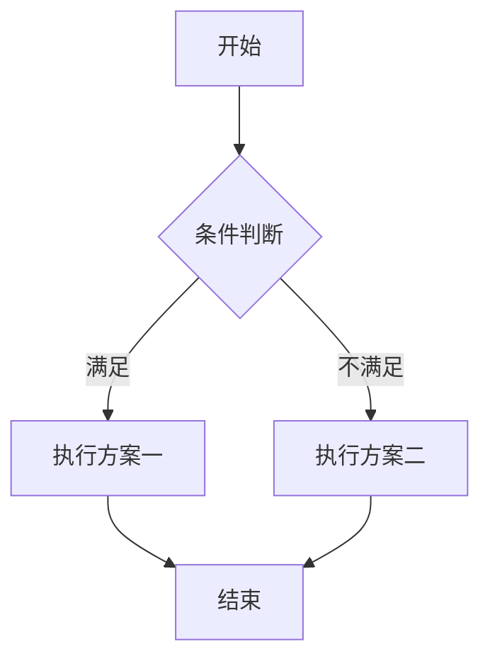
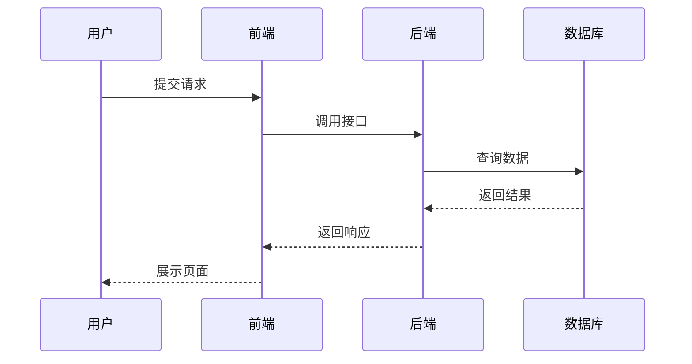
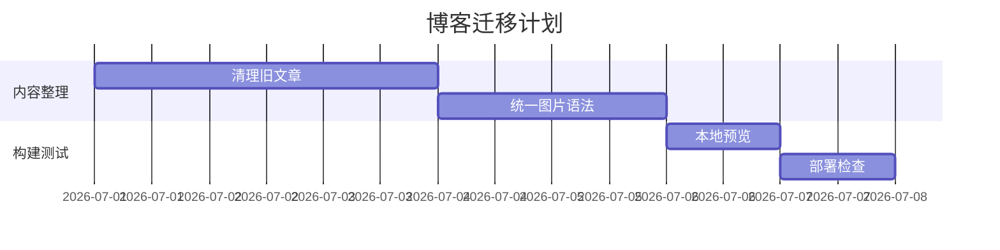

这篇文章由原来的 Markdown 基础教程、Markdown 扩展功能示例和 Mermaid 图表示例整理而来。原来的几篇文章更像完整语法清单，内容比较分散；这里把博客写作中真正常用的部分合并成一篇中文速查笔记，方便在 Obsidian 和 Quartz 中直接参考。

## Markdown适合解决什么问题

Markdown 的目标不是替代 Word 或 LaTeX，而是用尽量少的标记完成结构化写作。写博客时最常用的不是复杂排版，而是稳定地表达标题、段落、列表、引用、代码、表格、图片和链接。

它的优点在于：

- 源文件是纯文本，适合 Git 管理和长期保存。
- 语法足够简单，写作时不需要频繁离开键盘。
- 可以在 Obsidian 中编辑，也可以被 Quartz 构建成网页。
- 需要复杂内容时，可以通过扩展语法插入公式、代码高亮、Callout 和 Mermaid 图表。

## 基础块级语法

### 标题

标题使用 `#` 表示层级。一般一篇文章只保留一个一级标题，正文从二级标题开始组织会更清晰。

```markdown
# 一级标题
## 二级标题
### 三级标题
```

在 Quartz 中，文章标题通常由 YAML 头部的 `title` 字段控制，所以正文里不一定需要再写一个一级标题。

### 段落与换行

普通文本之间空一行就会形成新的段落。

```markdown
这是第一段。

这是第二段。
```

如果只是想在同一个段落中手动换行，可以在行尾输入两个空格，不过更推荐直接分段，源码更容易阅读。

### 引用

引用使用 `>` 开头，适合放备注、原文摘录或额外说明。

```markdown
> 这是一段引用。
> 
> 引用中也可以继续写 **加粗**、列表和链接。
```

效果如下：

> 这是一段引用。
>
> 引用中也可以继续写 **加粗**、列表和链接。

### 列表

无序列表可以使用 `-`，有序列表使用 `1.`、`2.`。

```markdown
- 第一项
- 第二项
- 第三项

1. 第一步
2. 第二步
3. 第三步
```

写博客时建议同一篇文章内尽量统一列表符号，例如无序列表固定使用 `-`。

### 代码块

行内代码使用反引号，代码块使用三个反引号。代码块后面可以写语言名称，让 Quartz 进行语法高亮。

````markdown
行内代码：`npm run build`

```python
def hello(name: str) -> str:
    return f"Hello, {name}"
```
````

效果如下：

```python
def hello(name: str) -> str:
    return f"Hello, {name}"
```

### 表格

表格使用 `|` 分隔列，第二行用 `---` 区分表头和表体。冒号可以控制对齐方式。

```markdown
| 语法 | 用途 | 备注 |
| :--- | :---: | ---: |
| `#` | 标题 | 左对齐 |
| `>` | 引用 | 居中 |
| ``` | 代码块 | 右对齐 |
```

效果如下：

| 语法 | 用途 | 备注 |
| :--- | :---: | ---: |
| `#` | 标题 | 左对齐 |
| `>` | 引用 | 居中 |
| ` ``` ` | 代码块 | 右对齐 |

表格适合展示少量结构化信息。如果内容很长，通常拆成小节比塞进表格更好读。

## 行内语法

### 强调与删除线

```markdown
*斜体*
**加粗**
~~删除线~~
```

效果如下：*斜体*、**加粗**、~~删除线~~。

### 链接

链接的基本写法是 `[显示文字](链接地址)`。

```markdown
[Quartz 文档](https://quartz.jzhao.xyz/)
```

如果是站内链接，可以写成相对路径或 Quartz/Obsidian 支持的内部链接形式。为了迁移和构建稳定，我更倾向于在博客里使用明确路径。

### 图片

图片语法和链接很像，只是在前面多一个 `!`。

```markdown

```

在当前博客中，单独成段的 Markdown 图片会被转换成带图注的图片：方括号里的文字会显示为图片下方的名称。这样比手写 HTML 更适合在 Obsidian 中维护。

### 转义

如果想显示 Markdown 里的特殊字符，可以使用反斜杠转义。

```markdown
\*这不是斜体\*
\# 这不是标题
```

## Quartz与Obsidian中的扩展语法

### Callout

Callout 适合写提示、警告和补充说明。Obsidian 风格的写法如下：

```markdown
> [!NOTE]
> 这是一条普通提示。

> [!WARNING]
> 这里可以写需要注意的风险。
```

效果如下：

> [!NOTE]
> 这是一条普通提示。

> [!WARNING]
> 这里可以写需要注意的风险。

### 折叠说明

如果内容很长，可以使用可折叠 Callout。

```markdown
> [!EXAMPLE]- 点击展开示例
> 这里可以放较长内容。
```

这种写法在 Quartz 和 Obsidian 中都比较友好，比直接手写 HTML 的兼容性更好。

### GitHub链接卡片

原来的扩展语法示例中提到，部分主题会把 GitHub 仓库链接渲染成卡片。例如：

```markdown
[matsuzaka-yuki/Mizuki](https://github.com/matsuzaka-yuki/Mizuki)
```

这类效果取决于主题或插件支持。迁移到 Quartz 后，如果没有对应插件，它会退化成普通链接。因此写作时不应该把关键信息完全依赖在卡片样式上。

### Spoiler

部分主题支持 `:spoiler[]` 这类隐藏文本语法：

```markdown
这是一段 :spoiler[默认隐藏的内容]。
```

同样需要注意，这不是 Markdown 标准语法。如果换主题或换渲染器，可能无法显示为预期效果。

## Mermaid图表

Mermaid 可以用纯文本画流程图、时序图、甘特图、类图和状态图。写技术文档时，它比截图更容易维护，因为图表本身也是文本，可以被 Git 追踪。

### 流程图

````markdown

````

效果如下：


### 时序图

时序图适合描述用户、前端、后端和数据库之间的交互。



### 甘特图

甘特图适合写项目计划。



## 写作建议

Markdown 的关键不是把所有语法都用上，而是让内容结构稳定。我的建议是：

- 文章结构优先使用标题、段落和列表，不要过度依赖 HTML。
- 图片尽量使用 Markdown 或 Obsidian 默认语法，方便在本地编辑器中预览。
- 表格只用于短信息对比，长内容改用小节。
- 代码块一定写语言名称，便于高亮和复制。
- Mermaid 适合表达流程和关系，不适合承载过多文字。
- 非标准扩展语法要谨慎使用，最好确认 Quartz 和 Obsidian 都能正常渲染。

对个人博客来说，Markdown 最重要的价值是降低写作和迁移成本。只要保持语法简单、文件结构清晰、附件路径稳定，一篇文章就可以同时服务于本地知识库和在线博客。
