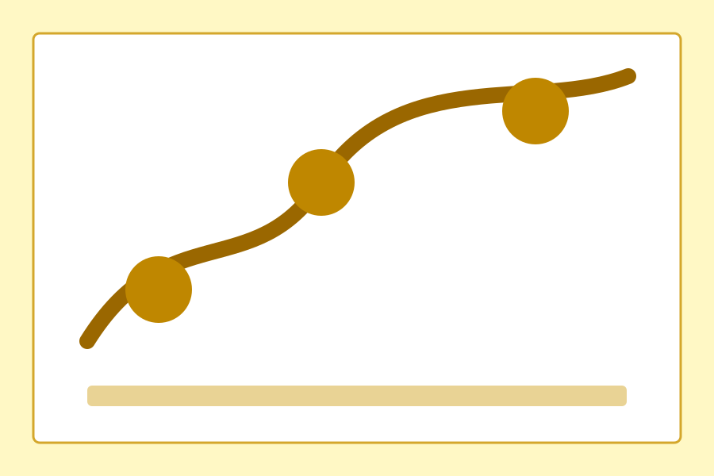
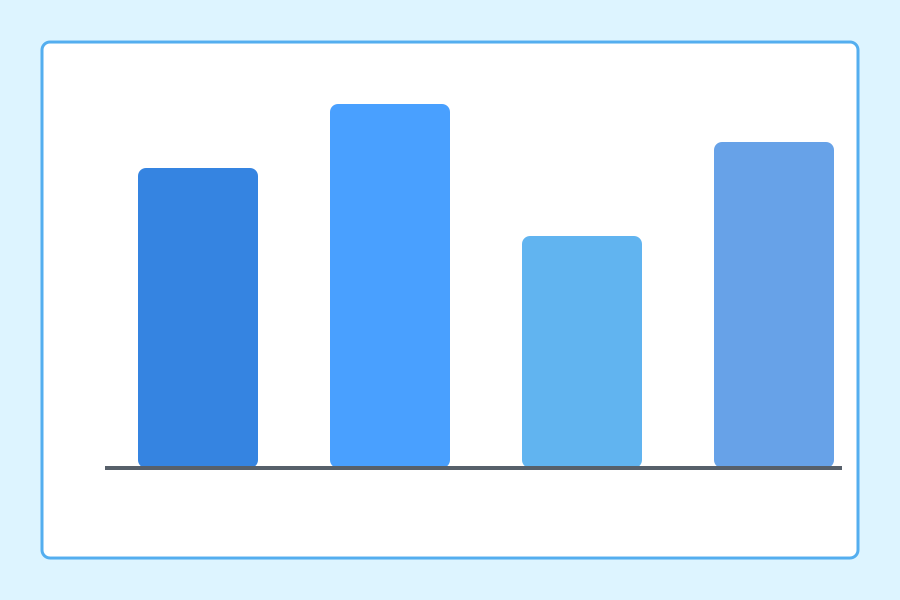

这是一篇用于检查 Quartz 渲染效果的测试文章，覆盖数学公式、PDF 嵌入、普通代码块、折叠超长代码块、表格、任务列表和引用等常见内容形态。

## 数学公式测试

行内公式示例：当 $a^2+b^2=c^2$ 时，三角形满足勾股关系。爱因斯坦质能方程可以写成 $E=mc^2$。

块级公式示例：

$$
\nabla \cdot \mathbf{D} = \rho_f,\qquad
\nabla \times \mathbf{E} = -\frac{\partial \mathbf{B}}{\partial t}
$$

矩阵与优化目标：

$$
\mathbf{K}\mathbf{u}=\mathbf{f},\qquad
\min_{\theta}\ \mathcal{L}(\theta)=\frac{1}{n}\sum_{i=1}^{n}\left(y_i-f_{\theta}(x_i)\right)^2+\lambda\lVert\theta\rVert_2^2
$$

分段函数：

$$
g(x)=
\begin{cases}
x^2, & x \ge 0 \\
-x, & x < 0
\end{cases}
$$

## PDF 嵌入测试

下面使用 Obsidian 原生附件嵌入语法测试 PDF 内嵌显示。Quartz 构建网页时会把这个 PDF embed 转成网页预览。

![[Attachments/提问的艺术How-To-Ask-Questions-The-Smart-Way.pdf]]

[打开 PDF 附件](/Attachments/提问的艺术How-To-Ask-Questions-The-Smart-Way.pdf)

## 图片嵌入测试

单张图片：


*单张图片测试*

并排图片：

|  |  |
| --- | --- |
| *并排图片左图* | *并排图片右图* |

## 图床测试

下面测试 jsDelivr 图床是否能在 Quartz 中正常显示：


*图床测试*

[打开图床原图](https://cdn.jsdelivr.net/gh/QTH1225/Blog_Figures/img/20251225163945225.webp)

## 普通代码块测试

Python 代码块：

```python
from dataclasses import dataclass


@dataclass
class Experiment:
    name: str
    samples: int
    accuracy: float


def summarize(exp: Experiment) -> str:
    return f"{exp.name}: n={exp.samples}, accuracy={exp.accuracy:.2%}"


if __name__ == "__main__":
    experiment = Experiment("quartz-render-test", 128, 0.973)
    print(summarize(experiment))
```

TypeScript 代码块：

```ts
type Author = {
  name: string
  link?: string
}

function renderAuthors(authors: Author[]) {
  return authors.map((author) => {
    const label = author.link ? `[${author.name}](${author.link})` : author.name
    return `Author: ${label}`
  })
}
```

## 折叠超长代码块测试

> [!note]- 点击展开超长代码块
> 下面是一段较长的 TypeScript 测试代码，用于检查折叠区域、代码高亮、复制按钮、横向滚动和长行显示。
>
> ```ts
> type NodeId = string
>
> interface GraphNode {
>   id: NodeId
>   label: string
>   tags: string[]
>   weight: number
> }
>
> interface GraphEdge {
>   source: NodeId
>   target: NodeId
>   relation: "references" | "depends-on" | "extends" | "contradicts"
>   confidence: number
> }
>
> interface Graph {
>   nodes: GraphNode[]
>   edges: GraphEdge[]
> }
>
> const graph: Graph = {
>   nodes: [
>     { id: "doc-001", label: "文档工程介绍与写法", tags: ["docs", "文档工程", "人工智能"], weight: 0.92 },
>     { id: "doc-002", label: "建立一份文档工程", tags: ["docs", "实践"], weight: 0.88 },
>     { id: "doc-003", label: "如何正确提问", tags: ["docs", "沟通"], weight: 0.81 },
>     { id: "doc-004", label: "Harness Engineering", tags: ["AI", "工程"], weight: 0.95 },
>   ],
>   edges: [
>     { source: "doc-001", target: "doc-002", relation: "depends-on", confidence: 0.91 },
>     { source: "doc-003", target: "doc-001", relation: "references", confidence: 0.77 },
>     { source: "doc-004", target: "doc-001", relation: "extends", confidence: 0.86 },
>   ],
> }
>
> function normalizeWeight(value: number) {
>   if (Number.isNaN(value)) return 0
>   if (value < 0) return 0
>   if (value > 1) return 1
>   return value
> }
>
> function scoreNode(node: GraphNode, incoming: GraphEdge[], outgoing: GraphEdge[]) {
>   const structuralScore =
>     incoming.reduce((sum, edge) => sum + edge.confidence, 0) * 0.4 +
>     outgoing.reduce((sum, edge) => sum + edge.confidence, 0) * 0.6
>
>   const tagBonus = node.tags.includes("docs") ? 0.08 : 0
>   return normalizeWeight(node.weight * 0.7 + structuralScore * 0.2 + tagBonus)
> }
>
> function rankGraph(input: Graph) {
>   return input.nodes
>     .map((node) => {
>       const incoming = input.edges.filter((edge) => edge.target === node.id)
>       const outgoing = input.edges.filter((edge) => edge.source === node.id)
>       return {
>         ...node,
>         score: scoreNode(node, incoming, outgoing),
>         incoming: incoming.length,
>         outgoing: outgoing.length,
>       }
>     })
>     .sort((a, b) => b.score - a.score)
> }
>
> const ranked = rankGraph(graph)
>
> for (const item of ranked) {
>   console.log(
>     `${item.id.padEnd(8)} | ${item.label.padEnd(24)} | score=${item.score.toFixed(3)} | tags=${item.tags.join(", ")}`,
>   )
> }
>
> const deliberatelyLongLineForHorizontalScrollTesting = "这是一行故意写得非常非常非常非常非常非常非常非常非常非常非常非常非常非常非常非常非常非常非常非常长的字符串，用来检查代码块在页面中是否能够正确横向滚动，而不是把整个页面撑破。"
> console.log(deliberatelyLongLineForHorizontalScrollTesting)
> ```

## 表格测试

| 模块 | 测试内容 | 预期表现 | 状态 |
| --- | --- | --- | --- |
| 数学公式 | 行内公式、块级公式、分段函数 | KaTeX 正常渲染 | 待检查 |
| PDF | Obsidian embed + 普通链接 | 页面内预览或可点击打开 | 待检查 |
| 图片 | 单张图片、并排图片 | 图片正常加载，并排图移动端自动堆叠 | 待检查 |
| 代码 | Python、TypeScript | 高亮、等宽字体、可复制 | 待检查 |
| 超长代码 | callout 折叠 + 长行 | 默认折叠，展开后高亮、复制、横向滚动 | 待检查 |
| 表格 | Markdown 表格 | 列宽稳定，移动端可滚动 | 待检查 |

## 引用与任务列表测试

> 这是一段引用内容，用来检查 blockquote 的边框、间距和文字颜色是否与当前主题一致。

- [x] 数学公式已经写入
- [x] PDF 嵌入已经写入
- [x] 图片嵌入已经写入
- [x] 普通代码块已经写入
- [x] 折叠超长代码块已经写入
- [x] 表格已经写入
- [ ] 构建后在浏览器中检查最终效果

## 内部链接测试

可以从这里跳转到 [[document-engineering-introduction-and-writing|文档工程介绍与写法]]，检查 wikilink 是否能正确解析为内部链接。
