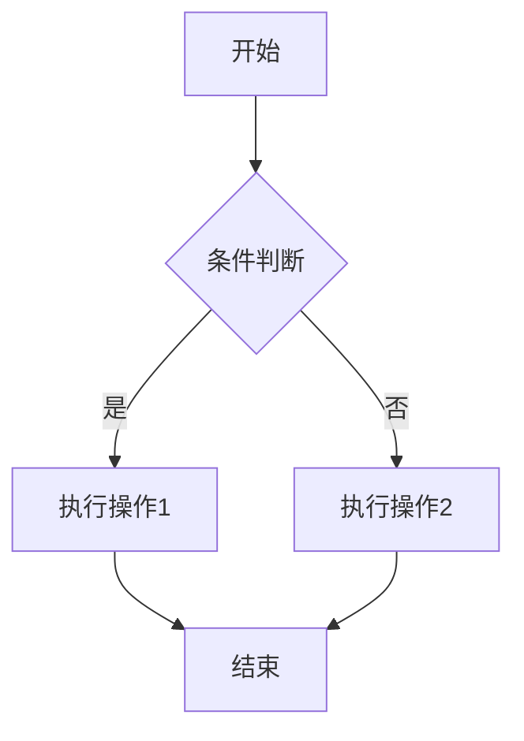
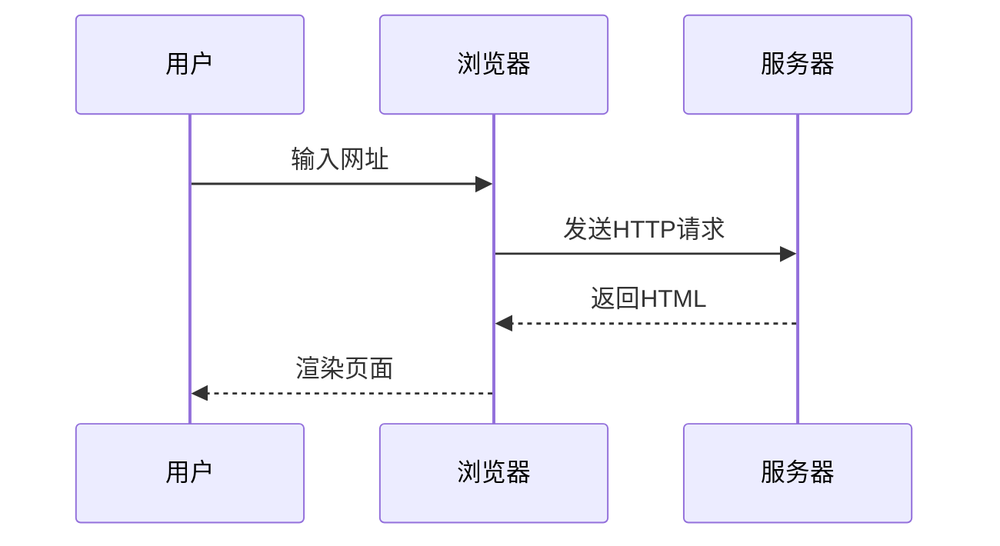
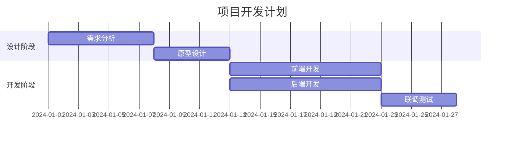

 
The rest of your content lives here. You can use **Markdown** here :)

# 博客功能测试文章

本文用于测试博客系统的Markdown渲染效果，包含以下模块：

- LaTeX 数学公式
- 代码片段高亮
- Mermaid 图表
- 列表样式
- 引用、表格、链接等

---

## 1. LaTeX 数学公式

### 行内公式
欧拉公式：$e^{i\pi} + 1 = 0$

### 块级公式
$$
\int_{-\infty}^{\infty} e^{-x^2} \, dx = \sqrt{\pi}
$$

### 多行公式（使用aligned环境）
$$
\begin{aligned}
\nabla \times \mathbf{E} &= -\frac{\partial \mathbf{B}}{\partial t} \\
\nabla \times \mathbf{B} &= \mu_0 \mathbf{J} + \mu_0 \epsilon_0 \frac{\partial \mathbf{E}}{\partial t}
\end{aligned}
$$

---

## 2. 代码片段

### Python 示例
```python
def fibonacci(n):
    """返回斐波那契数列的第n项"""
    a, b = 0, 1
    for _ in range(n):
        a, b = b, a + b
    return a

print(fibonacci(10))  # 输出55
```

### JavaScript 示例
```javascript
// 异步请求示例
async function fetchData(url) {
    try {
        const response = await fetch(url);
        const data = await response.json();
        console.log(data);
    } catch (error) {
        console.error('Error:', error);
    }
}
```

### 命令行示例
```bash
# 安装依赖
npm install marked --save-dev

# 启动服务
python -m http.server 8000
```

---

## 3. Mermaid 图表

### 流程图


### 时序图


### 甘特图


---

## 4. 列表样式

### 无序列表
- 苹果
  - 红富士
  - 嘎啦
- 香蕉
- 橙子

### 有序列表
1. 第一步：准备工作
   2. 安装依赖
   3. 配置环境
4. 第二步：编写代码
5. 第三步：测试运行

### 任务列表
- [x] 完成文章草稿
- [ ] 添加图片示例
- [ ] 发布到博客

---

## 5. 其他元素

### 引用块
> 这是一段引用文本。
> 
> 可以包含**多行**内容，甚至`代码`引用。

### 表格
| 功能 | 支持情况 | 备注 |
|------|----------|------|
| LaTeX | ✅ | 需支持MathJax或Katex |
| 代码高亮 | ✅ | 需配置语言 |
| Mermaid | ✅ | 需加载插件 |
| 脚注 | ❌ | 部分平台不支持 |

### 图片（占位）


### 链接
[Markdown 官方教程](https://www.markdownguide.org/)

### 水平分割线
---

## 总结

本文档涵盖了博客常用的Markdown特性，可根据实际渲染效果调整CSS样式或插件配置。如有问题，欢迎反馈！
```
